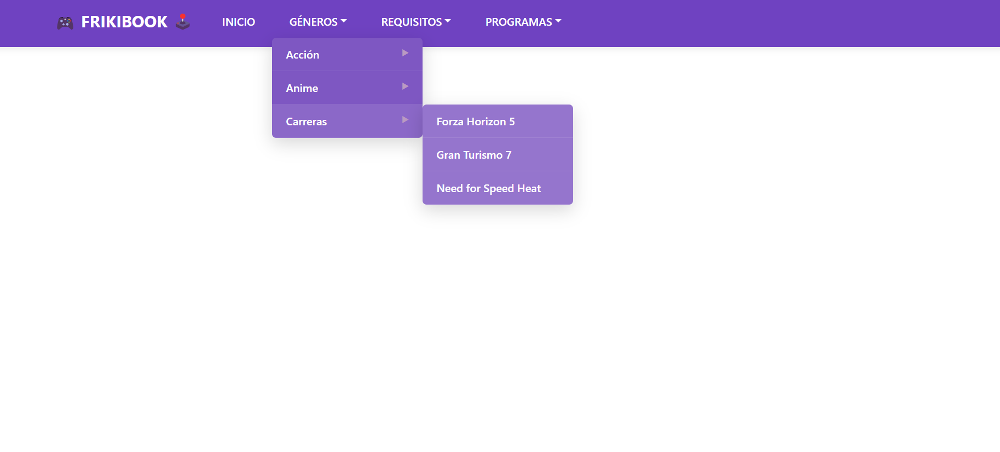

# 🎮 FrikiBook – Menú Dinámico Recursivo 🚀

Un menú de navegación web interactivo que implementa submenús anidados de forma recursiva, desarrollado con Flask y Bootstrap, y diseñado con una paleta de colores morados de alto impacto.

## 📂 Datos del Proyecto 🧑‍💻

- **Proyecto:** FrikiBook – Menú Dinámico Recursivo
- **Tecnologías:** Python 3.x, Flask, Bootstrap 5
- **Autor:** Arath Yahir Lopez Guzman
- **Materia:** Estructura de Datos 

## 🎨 Diseño de Interfaz

La interfaz presenta un estilo moderno con tonos morados análogos, sombras suaves y detalles en color de acento. Permite navegar cómodamente por categorías con submenús desplegables.



&#x20;

## 🚀 Instrucciones de Ejecución

1. Asegúrate de tener Python 3.x instalado 🐍
2. Clona el repositorio:
   ```bash
   git clone https://github.com/SoyArath/Tema-2.git
   cd frikibook-menu
   ```
3. Crea un entorno virtual e instala las dependencias:
   ```bash
   python -m venv venv
   source venv/bin/activate   # Linux/Mac
   venv\Scripts\activate      # Windows
   pip install -r requirements.txt
   ```
4. Ejecuta la aplicación:
   ```bash
   python main.py
   ```
5. Abre tu navegador en `http://127.0.0.1:5000` 🌐

## 📁 Estructura de Archivos

```text
frikibook-menu/
├─ main.py            # Servidor Flask
├─ requirements.txt  # Dependencias
├─ templates/
│  └─ menu.html      # Plantilla del menú dinámico
```

## 📖 Descripción de Componentes

- **main.py:** Inicializa la aplicación Flask y renderiza `menu.html`.
- **menu.html:** Define la estructura HTML del menú con clases para submenús recursivos.
---
